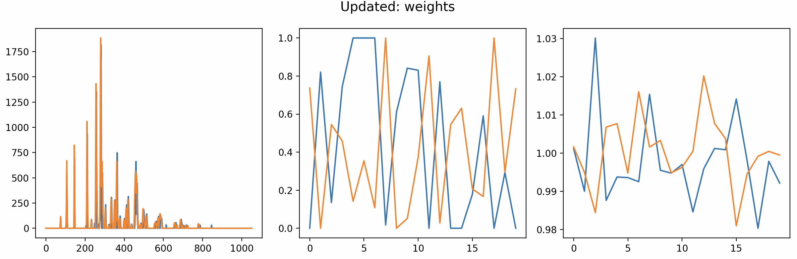
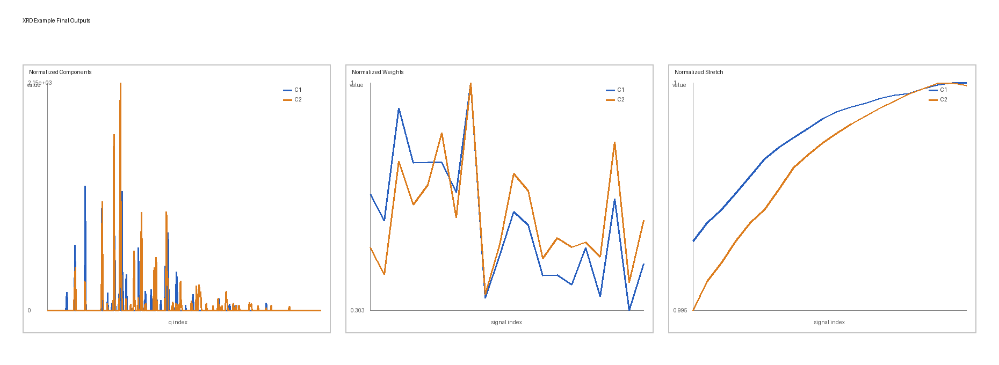

.. _getting-started:

Getting started
===============

``diffpy.stretched-nmf`` implements the stretched NMF algorithm for factorizing signal
sets while accounting for uniform stretching along the independent axis.

Installation
------------

The preferred method is conda:

.. code-block:: bash

   conda config --add channels conda-forge
   conda create -n diffpy.stretched-nmf_env diffpy.stretched-nmf
   conda activate diffpy.stretched-nmf_env

Alternatively, install from PyPI with pip:

.. code-block:: bash

   pip install diffpy.stretched-nmf

For source installs (after cloning the repo):

.. code-block:: bash

   pip install .

Quick check
-----------

Verify the CLI and Python import:

.. code-block:: bash

   diffpy.stretched-nmf --version
   python -c "import diffpy.stretched_nmf; print(diffpy.stretched_nmf.__version__)"

Basic usage
-----------

The main entry point is the ``SNMFOptimizer`` class. Create an
``SNMFOptimizer`` with hyperparameters, then pass the source matrix to
``fit``. The source matrix shape is
``(length_of_signal, number_of_signals)``.

.. code-block:: python

   import numpy as np
   from diffpy.stretched_nmf.snmf_class import SNMFOptimizer

   rng = np.random.default_rng(7)
   source_matrix = rng.random((300, 24))  # (signal_length, n_signals)

   snmf = SNMFOptimizer(
       n_components=3,
       max_iter=400,
       min_iter=20,
       tol=5e-7,
       rho=0,
       eta=0,
       random_state=7,
       show_plots=False,
   )

   snmf.fit(source_matrix=source_matrix, reset=True)

   components = snmf.components_
   weights = snmf.weights_
   stretch = snmf.stretch_

Notes
-----

- ``rho`` controls the stretching penalty (set to ``0`` for no stretching).
- ``eta`` controls sparsity (start at ``0`` and tune after selecting ``rho``).
- Use ``reset=False`` only when you want to continue from the current solution.

XRD example
-----------

A complete real-data example is included in
``docs/examples/XRD_MgMnO_YCl_real.py``. It reads the input matrices from
``docs/examples/data/XRD_MgMnO_YCl_real``.

Run it from the repository root:

.. code-block:: bash

   python docs/examples/XRD_MgMnO_YCl_real.py

The script runs a tuned XRD fit and writes
``my_norm_components.txt``, ``my_norm_weights.txt``, and
``my_norm_stretch.txt`` to the current working directory.

   Preview from the ``show_plots`` interface from before the optimization has settled down.

   Final outputs: normalized components, normalized weights, and normalized stretch shown side by side.

Next steps
----------

Browse the rest of the docs for release notes and license information.
